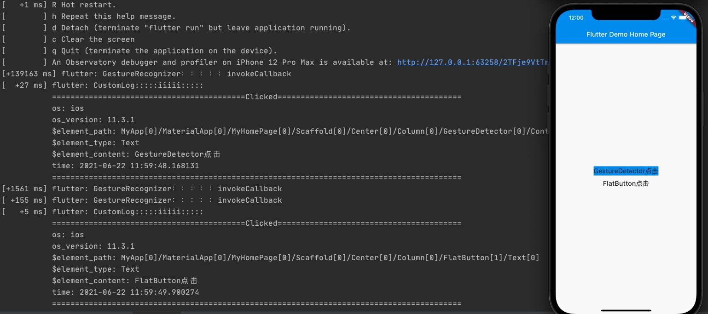
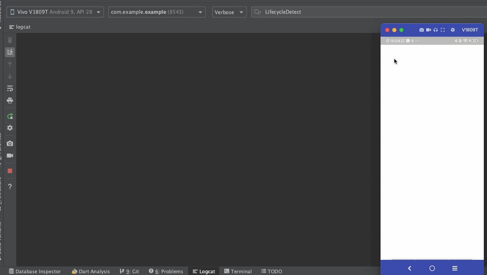

## Flutter Aop Demo
该项目是在阿里开源项目aspectd基础上进行更改

其中全埋点是参考大佬文章实现的
[Flutter之全埋点思考与实现](https://juejin.cn/post/6892371163859976199#heading-3)

使用的是flutter 1.22.5，其他版本没有做兼容

## 全埋点
在flutter页面点击的时候获取到我们点击的内容

效果如下：

## 全局生命周期
当我们在做性能收集时，需要全局的知道哪个页面目前在展示，哪个页面关闭了，从而做一些收集工作，在Android中我们可以通过registerActivityLifecycleCallbacks来得到任何一个正在展示页面的生命周期

而在Flutter中并没有提供类似方式，当然我们可以通过一个一个页面的监听，但这样侵入性太强了，我们可以使用aspectd来hook具体执行方法实现生命周期监听。

效果如下：

